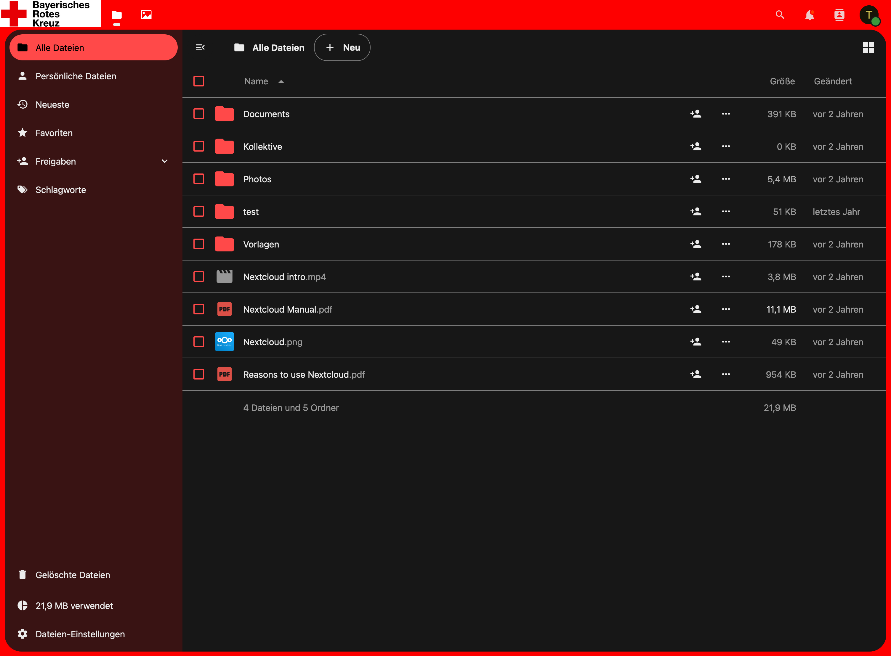

# BRK Theme

Das ist eine BRK-Theme für [Nextcloud](https://nextcloud.com).

## Unterstützte Versionen

Aktuell unterstützte Versionen sind:

-   Nextcloud 29

## Version numbering

Dieses Projekt folgt semantischer Versionierung. Die Hauptversion entspricht immer der Nextcloud Version auf die das Release abzielt.

## Installation

Klone dieses Repository in den app Ordner deiner Nextcloud und aktiviere die App im App-Menü der Nextcloud.
Das Theme ist dann aktiv.